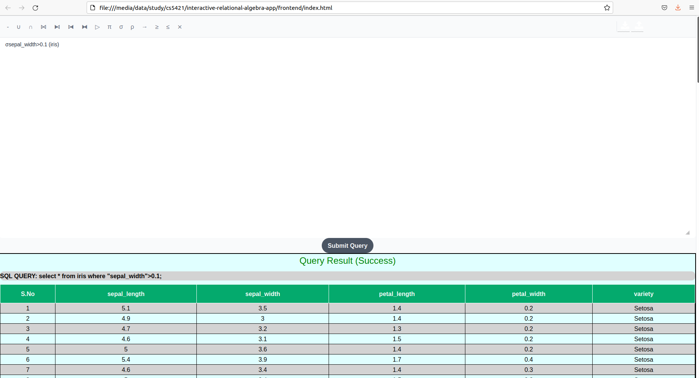

# CS4221/CS5421: Interactive Relational Algebra

**Group 4**

## Descripton
A web app which allows users to input relational algebra query and view equivalent PostgreSQL query and its output.



## Showcase of different relational algebra query executions + basic usage of load/upload xml endpoint

- Relevant postman collection here: https://elements.getpostman.com/redirect?entityId=17271995-fb1500f7-97c0-4fac-a890-b549a4a924d8&entityType=collection
- Details provided on the usage of the postman collection below

https://user-images.githubusercontent.com/44941115/229572810-7d76e4bd-9235-4d24-950b-dc284081f024.mp4


## Installation

`pip3 install -r backend/requirements.txt`


## Commands to run app
Please make sure backend is already running before running the frontend.

### To run the backend

`cd backend` from root of the repo.

**Setup DB:** (DB to be created only once)

  `sudo -i -u postgres psql`

  `create database ira;` 

  Quit from the `psql` prompt by  `\q`

**Run the server locally:**

`python3 manage.py runserver`

### To run the frontend
 Simply open `index.html`. It is found under the frontend folder.

### Default database schema supported
 | **iris**     | **products** | **sales**     |
|--------------|--------------|---------------|
| sepal_length | ProductID    | ProductID     |
| sepal_width  | ProductName  | InvoiceNumber |
| petal_length | Price        |               |
| petal_width  |              |               |
| variety      |              |               |

 
### To add more tables to the database

Simply add a well formed csv file to the folder [`backend/ira/resources/prepopulation`](https://github.com/cs5421-project/interactive-relational-algebra-app/tree/main/backend/ira/resources/prepopulation) and run the backend app for creation and population of the tables.

## To run [unit tests](https://github.com/cs5421-project/interactive-relational-algebra-app/tree/main/backend/ira/tests/service) for the backend

`cd backend`

`python3 manage.py test`


## Grammar
```
IDENT = ( LETTER )( LETTER | DIGIT | '_')*
QUERY = IDENT
QUERY = QUERY BIN_OP QUERY
QUERY = σ SELECTIONEXPR (QUERY)
QUERY = π COLUMNLIST (QUERY)
QUERY = ρ IDENT ➡ IDENT (, IDENT ➡ IDENT)* (QUERY)
SELECTIONEXPR = conditional_epxression | '(' conditional_expression ((and|or|not)(conditional_expression))* ')'
COLUMNLIST = IDENT | IDENT ',' COLUMNLIST
BIN_OP = * | - | ∪ | ∩ | ÷ | ⋈ | ⧑ | ⧒ | ⧓
```

## UML and Package diagram
Look under the [`resources`](https://github.com/cs5421-project/interactive-relational-algebra-app/tree/main/resources) folder at the root level.

## Note
To checkout the backend api: 

- Clone this repository.

- Run the backend app in your local machine.

- [Export](https://learning.postman.com/docs/getting-started/importing-and-exporting-data/#exporting-collections) the  [**relevant postman collection here**](https://elements.getpostman.com/redirect?entityId=17271995-fb1500f7-97c0-4fac-a890-b549a4a924d8&entityType=collection).

- Load it in your desktop postman app.


## References
Backend:

Idea to use `pandas` package to use a csv file to populate the Postgres DB is from https://apoor.medium.com/quickly-load-csvs-into-postgresql-using-python-and-pandas-9101c274a92f


Got the idea on how to create a dictionary which allows duplicate key from here:
https://stackoverflow.com/questions/29519858/adding-duplicate-keys-to-json-with-python

Datasets:

iris csv: 
https://gist.github.com/netj/8836201

products and sales csv:
https://www.sqlservercentral.com/articles/join-two-csv-files-with-a-common-column
Note: Original dataset was delimited by semicolons, and this had been changed to commas.

